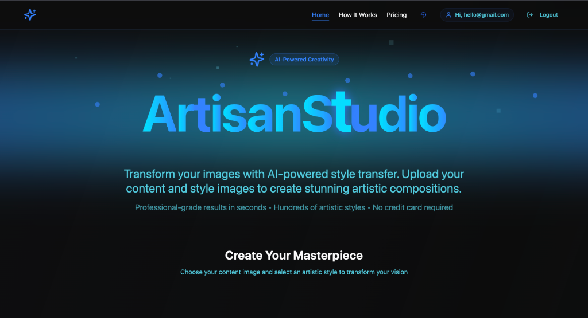

<div align="center">

# ✨ Artisian Studio

### *Where Neural Networks Meet Artistic Vision*

[](https://fastapi.tiangolo.com/)
[](https://reactjs.org/)
[](https://www.tensorflow.org/)
[](https://vitejs.dev/)

**Artisian Studio** is a premium, AI-powered sanctuary where your images transform into high-fidelity masterpieces. Leveraging state-of-the-art Neural Style Transfer and ESRGAN Super-Resolution, we breathe life into pixels.



[Explore the Magic](#-the-magic-behind-the-code) • [Quick Start](#-installation) • [Divine Tech](#-divine-tech-stack)

</div>

---

## 🎨 Features

- **🎭 Neural Stylization**: Seamlessly blend the essence of master painters with your own photographs.
- **🚀 Ultra-HD 4K Export**: Every creation is upscaled using **ESRGAN** for sharp, professional-grade results.
- **🔒 Secure Sanctuary**: Robust JWT authentication ensures your creative gallery remains private.
- **✨ Ethereal UI**: A mesmerizing 3D interface built with Three.js and Framer Motion.
- **⚡ Proactive Performance**: Optimized models that pre-load for instant creative gratification.

---

## 🧠 The Magic Behind the Code

Artisian Studio utilizes a sophisticated **Two-Stage AI Pipeline** to ensure that artistic beauty meets technical precision.

### 🎭 Stage 1: Arbitrary Image Stylization (Google Magenta)
At its core, we use Google's **Magenta Arbitrary Image Stylization** model. Unlike traditional filters that simply overlay colors, this neural network:
- **Semantic Interpretation**: Analyzes the high-level semantic features of both the content and style images.
- **Neural Synthesis**: Reconstructs the content image from scratch using the specific brush strokes, textures, and geometry of the style image.
- **Dynamic Mastery**: Can apply *any* artistic style to *any* image in seconds, providing infinite creative possibilities.

### 🚀 Stage 2: 4K Super-Resolution (ESRGAN)
Neural stylization often results in soft edges or low resolution. To deliver a premium product, we pass every stylized image through **ESRGAN** (Enhanced Super-Resolution Generative Adversarial Networks):
- **4x Upscaling**: Mathematically enhances the image resolution by 400%.
- **Pattern Sharpening**: Uses a discriminator network to "invent" realistic detail where data was lost, resulting in crisp, high-definition 4K masterpieces.
- **Clarity**: Ensures that even the most abstract textures remain sharp and professional-grade.

---

## 🛠️ Divine Tech Stack

- **The Vision**: `React 18`, `Tailwind CSS`, `Framer Motion`
- **The Soul**: `Python 3.9`, `FastAPI`, `Uvicorn`
- **The Brain**: `TensorFlow Hub` (Google Magenta + ESRGAN)
- **The Memory**: `JWT Auth`, `Bcrypt`, `JSON Persistent Storage`

---

## ⚡ Quick Start

### 1. Summon the Source
```bash
git clone https://github.com/prakritea/Neural-Style-Transfer.git
cd Neural-Style-Transfer
```

### 2. Prepare the Canvas (Frontend)
```bash
npm install
npm run dev
# Dashboard at http://localhost:8080
```

### 3. Awaken the Brain (Backend)
```bash
cd backend
pip install -r requirements.txt
python3 -m uvicorn main:app --reload --port 8000
# Neural API at http://localhost:8000
```

---

## 📖 The Creative Flow

1. **Enter the Studio**: Sign Up and Log In to your personal creative sanctuary.
2. **Select Content**: Upload the photograph you wish to transform.
3. **Impose Style**: Upload the artistic vision (style) you want to apply.
4. **Alchemize**: Click **Generate Artwork** and wait for the AI to composite your 4K masterpiece.

---

<div align="center">
Built with passion for digital art 🎨✨
</div>
